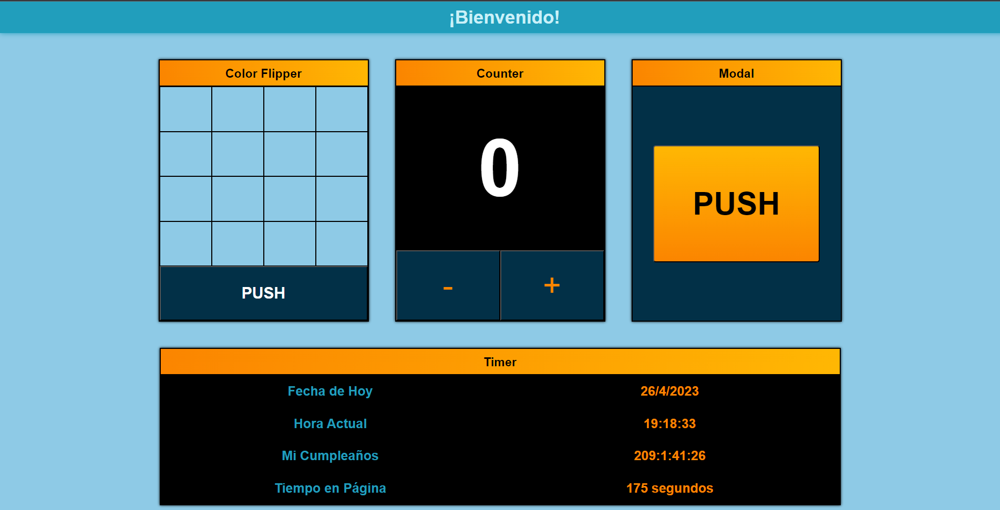

## Proyecto: Muchos en 1

#### ✔️Este es un proyecto realizado con HTML, CSS y JavaScript

#### ✔️Color Flipper: Utilizamos el objeto Math para obtener muchos colores aleatorios cada vez que damos click en "Push".

#### ✔️Counter: Un simple contador en el que al hacer click en + o -, incrementa o decrementa su numero, cambiando así el color del mismo.

#### ✔️Modal: Al hacer click en "Push" nos lleva a una ventana emergente que debemos cerrar para poder seguir interactuando con la página.

#### ✔️Timer: Utilizamos el objeto Date para obtener fecha y hora actual. Además realizamos un cronometro y una cuenta regresiva, basandonos en dicho objeto.

#### ✔️Responsive.
